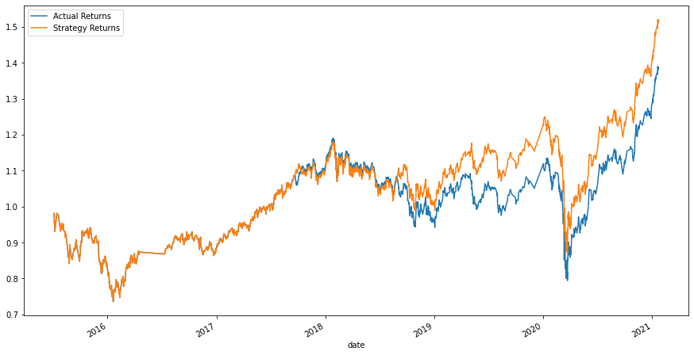
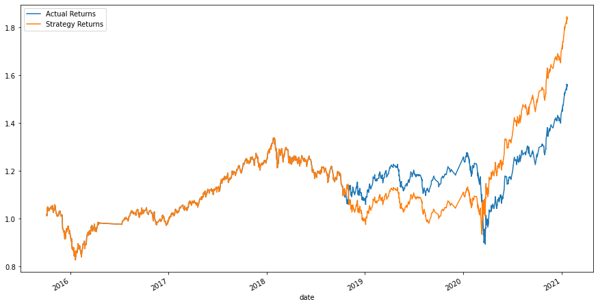

# Machine_Learning_Trading_Bot

This application creates, trains, tests, tunes and compares algorithmic trading bots to maximize trade investment returns.

---

## Technologies

This project leverages python 3.7. It utilizes the following packages:

**[Pandas Library Python](https://pandas.pydata.org/)** - a fast, powerful, flexible and easy to use open source data analysis and manipulation tool.<br>

**[Numpy Library Python](https://numpy.org/)** -  comprehensive mathematical functions.<br>

**[pathlib Library Python](https://pathlib.readthedocs.io/en/pep428/)** - offers a set of classes featuring all the common operations on paths in an easy, object-oriented way.<br>

**[HoloViews Library Python](https://holoviews.org/)** - an open-source Python library designed to make data analysis and visualization seamless and simple. <br>

**[Matplotlib Python](https://matplotlib.org/)** - comprehensive library for creating static, animated, and interactive visualizations in Python.<br>

**[scikit-learn Python](https://scikit-learn.org/)** - simple and efficient tools for predictive data analysis.<br>


---

## Installation Guide

Before running the application install the following dependencies:

1) Pandas Library is included with Anaconda so no need to install.<br>

2) Numpy Library is included with Anaconda so no need to install.<br>

3) pathlib is included with Anaconda so no need to install.<br>

4) In order to use the HoloViews library, you must install it by writing this command in your terminal:

```python
pip install holoviews
```

5) Matplotlib is included with Anaconda so no need to install.<br>

6) Scikit_learn Library is included with Anaconda so no need to install.<br>

The installation of libraries and dependencies is now complete.

---

## Usage

To use the application simply clone the repository and run the **machine_learning_traading_bot.ipynb** file with:

```python
machine_learning_trading_bot.ipynb
```

For best results, it is recommended to open as a Jupyter Notebook.

---

## Background

The app creates a baseline trading algorithm. Then, the baseline is tuned and adjusted as described below:

   1. The model compared test results using two different test timeframe slices of three months and six months, begining April 20, 2015. While the strategy using the longer timeframe initially does not produce returns greater than that of the actuals, in the longrun they greatly outperform the returns of the actuals and of the shorter timeframe strategy. Therefore, the bot was adjusted to utilize the longer test dataset.

   2. The model compared test results using different SMA periods. By increasing the SMA short and long windows from 4 & 100 to 20 & 150, the returns decreased. Ultimately, the increase in SMA windows resulted in returns below that of the actual returns. Therefore, the original windows on 4 & 100 are utilized in this bot. 

The visualizations below compare the baseline algorthim to the tuned algorithm, as described in the section above:

Baseline:



Tuned:




---


## Contributors

**Contributor:** Lindsey Hardouin<br>
**Email Address:** lindseyhardouin@gmail.com<br>
